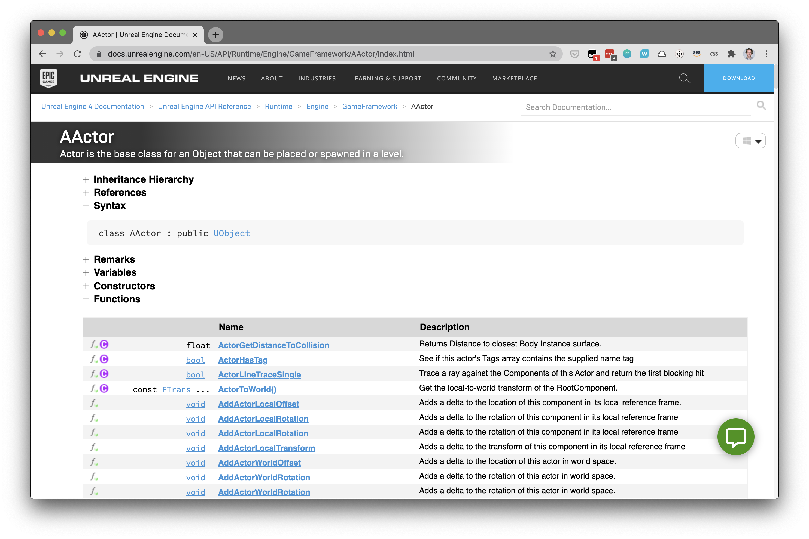

# UE4 Docs Prettier

A Tampermonkey script that makes the Unreal Engine 4 C++ API documentation easier to read and use.

## Prerequisites

- Requires the [Tampermonkey](https://www.tampermonkey.net/) extension for your browser.

## Installation

1. Click on the [ue4-docs-prettier.user.js](ue4-docs-prettier.user.js) file in this repository.
2. Click the "Raw" button.
3. The Tampermonkey installation UI will appear. Click the "Install" button.

After installing, whenever you visit a page under the API section of the Unreal Engine documentation the script will take affect.

